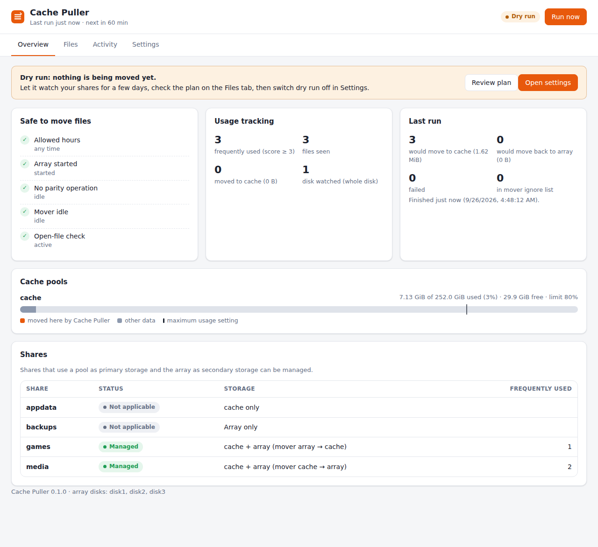
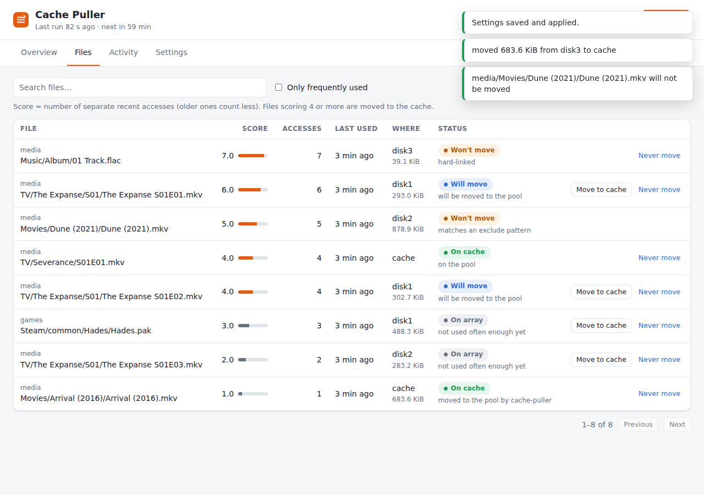

# unraid-cache-puller

A Docker container for Unraid that keeps your **frequently used files on the
cache pool**, for shares whose primary storage is a pool and whose secondary
storage is the array.

Unraid's mover works by rule ("everything to the array" or "everything to the
cache"). This container works by use: it watches which files actually get
opened and moves the hot ones from the array to the share's pool, so
they load from the SSD and the array disks can stay spun down.

## How it works

1. **Tracking.** fanotify watches each array disk and pool as a whole, with
   one mark per disk, so it starts instantly and has no watch limit. Only
   opens inside managed shares (`/mnt/diskN/<share>`, `/mnt/<pool>/<share>`)
   are counted, including opens through `/mnt/user` (shfs opens the underlying
   file on the disk). Without the capabilities fanotify needs, it falls back
   to inotify, which has to find and watch every folder first (see
   [Notes](#notes-and-limitations)). Opens of the same
   file within 15 minutes count once. Each file gets a score that works
   like a count of accesses with a 72-hour half-life. Renames (e.g. by
   Sonarr/Radarr) carry the score over.
2. **Promoting.** Every hour, files with a score of at least `MIN_SCORE`
   (default 3) that are only on the array are moved to the share's pool,
   hottest first, while the pool stays under `CACHE_MAX_PERCENT` and above
   `CACHE_MIN_FREE`.
3. **Keeping them there.** For `yes` shares (mover: pool → array), the
   container writes a list of hot files on the pool to
   `/config/mover-ignore.txt`. You can plug this into the
   [Mover Tuning plugin](#mover-integration) so the mover leaves them alone.
4. **Making room.** If the pool goes over `CACHE_MAX_PERCENT`, files the
   container promoted earlier that have since gone cold are moved back to
   the array disk they came from.

### Which shares are managed

| Primary storage | Secondary storage | Mover action | Managed? |
|---|---|---|---|
| pool | array | pool → array (`yes`) | ✅ |
| pool | array | array → pool (`prefer`) | ✅ |
| pool | none (`only`) | – | ❌ |
| array (`no`) | none | – | ❌ |
| pool | another pool (Unraid 7) | – | ❌ |

You can narrow this down with `INCLUDE_SHARES`, `EXCLUDE_SHARES` and `SHARE_MODES`.

## Safety

Moving files around underneath a running server has to be boring and
predictable. The container:

- **Starts in dry-run mode.** Nothing is changed until you switch dry run off
  (in the web UI under Settings, or with `DRY_RUN=false`).
  In dry-run the web UI (and the log) shows what would happen.
- **Never deletes the original before the copy is verified.** Each move copies
  into a hidden temp file next to the destination, fsyncs it, drops it from
  the page cache and re-reads it from disk to compare a BLAKE2 checksum. Only then
  is it published with `link()` (which fails instead of overwriting anything),
  and only then is the original deleted. There is never a moment where the
  file exists in neither place.
- **Aborts if the file is touched.** The source is checked for changes (inode,
  size, mtime, ctime) and for open handles (any process on the host, including
  shfs and Plex) before copying, after copying, and right before deleting. If
  anything changed, the copy is removed and the original stays.
- **Waits for the right moment.** Nothing moves while the array isn't started,
  during a parity check/rebuild, while the mover is running (pid file or
  `mover` / `age_mover` process), or outside `ALLOWED_HOURS` if you set it. These
  checks run before every single file.
- **Leaves tricky files alone.** It skips hard-linked files (common with *arr
  setups; moving would break the link and double the used space), symlinks,
  files that exist on more than one disk, files modified in the last hour,
  temp/partial downloads (`EXCLUDE_PATTERNS`) and files that already exist on
  the pool.
- **Keeps metadata.** Owner, permissions, timestamps and extended attributes
  are copied. Missing parent directories are created with the owner and mode of
  their array counterparts. On ZFS pools it won't create a missing share
  directory (Unraid creates datasets for those).
- **Recovers from crashes.** The temp file of the transfer in progress is
  recorded in a journal and removed on the next start. A crash at the worst
  possible moment leaves the file on both the pool and the array with identical
  content, and shfs serves the pool copy.
- **Only moves back what it moved.** Pressure relief (demotion) only touches files
  this container promoted and that have gone cold, never your other files on
  the pool.

## Installation

### With the Compose Manager plugin

A ready-made image is published at
`ghcr.io/cnoblereimer/unraid-cache-puller`, built and tested by GitHub
Actions on every change to `main`.

1. In the Docker tab, under **Compose**, click **Add New Stack**, name it
   `cache-puller`, and choose **Edit Stack → Compose File**.
2. Paste the contents of [`docker-compose.yml`](docker-compose.yml). Set `TZ`
   to your time zone. Change the `8484` port if it's already in use.
3. Save, then click **Compose Up**.
4. Open `http://<your-server>:8484/` (or use **WebUI** in the Docker tab's
   container menu).

To update: **Update Stack** (downloads the latest image), then **Compose Up**.
Your data and settings live in `/mnt/user/appdata/cache-puller` and are kept.

**Image tags:** `latest` follows `main`; version tags such as `0.2.0` are
published for releases (git tags `v0.2.0`); `sha-<commit>` pins an exact build.
Use a version tag instead of `latest` if you want to update only when you
choose to.

### Building the image yourself

Clone the repository (e.g. to `/mnt/user/appdata/cache-puller/source`), and
in the compose file replace the `image:` line with these two:

```yaml
    build: /mnt/user/appdata/cache-puller/source
    image: unraid-cache-puller:local
```

To update: `git pull` in that folder, `docker build -t unraid-cache-puller:local .`,
then **Compose Down** and **Compose Up**. Plain `docker compose up -d --build` in the source folder
works too.

### Unraid Docker template

Copy `unraid/cache-puller.xml` to
`/boot/config/plugins/dockerMan/templates-user/my-cache-puller.xml`, then in
the Docker tab choose **Add Container** → template **cache-puller**.

### What the container needs, and why

- `pid: host` and the `SYS_PTRACE` capability: to see which files are open
  on the host and whether the mover is running. Without them, the container
  refuses to move anything (unless you set `OPEN_FILE_CHECK=auto` or `off`,
  which isn't recommended).
- The `SYS_ADMIN` and `DAC_READ_SEARCH` capabilities: for fanotify, which
  watches whole disks at once. Without them it still works, but falls back
  to scanning every folder at startup. The container only uses them for
  fanotify and to turn fanotify's file handles into paths.
- `/mnt:/mnt:rw,slave`: must be `/mnt` on both sides so the paths in the mover
  ignore list are valid on the host. `slave` makes disks mounted after the
  container started (array stop/start) visible.
- `/boot/config/shares` and `/var/local/emhttp` (read-only): share settings and
  array/parity state.
- A port for the web UI. The UI is meant for your LAN. Set `UI_PASSWORD` to
  require a password (any user name works).

## Using the web UI



**Overview** shows whether it's safe to move files right now (array
started, no parity check, mover idle, open-file check working), how many
files are being tracked, what the last run did, how full each cache pool is
(including how much of it Cache Puller put there), and which shares are
managed.

**Files** lists every file that has been opened, most-used first, with its
score, where it is now (which disk, or the cache), and what will happen to it:

| Status | Meaning |
|---|---|
| **Will move** | Used often enough; moved to the cache on the next run |
| **On array** | Not used often enough (yet) |
| **On cache** | Already on the pool |
| **Won't move** | Skipped for a safety reason, which is shown (hard-linked, excluded, modified recently, …) |



Click a column header (File, Score, Accesses, Last used, Size) to sort by it;
click it again to reverse the order. The filters above the list narrow it down
by share, status, location (the cache pool, the array, or one disk) and when a
file was last used, and they combine with the search box. The browser
remembers your filters and sort order, and **Clear filters** resets them.
**Review plan** on the Overview opens the list filtered to *Will move*.

Filtering by status or location, and sorting by size, needs every file
looked up on the disks. The first time takes a few seconds with many files
(and can wake sleeping disks); the results are then reused for a few minutes,
and refreshed after every run, move, cleanup or settings change.

Each file has two buttons. **Move to cache** moves it right away, whatever its
score (all safety checks still apply). **Never move** adds it to the exclude
patterns.

Files that were deleted disappear from the list on their own (see
[Deleted files](#deleted-files)). A file marked **Gone** can also be removed
right away with **Remove from list**, and **Clean up now** at the top of the tab
checks every file immediately.

**Activity** is the log of every move made, skipped or failed.

**Settings** has every option with an explanation. Changes apply
immediately, no restart needed. They are saved in
`/config/settings.json` and override the container's environment variables.
**Reset all to container defaults** removes them.

### First steps

1. Leave **Dry run** on. The container knows nothing about past usage when it
   first starts, so let it watch for a few days.
2. Check **Overview**: every safety check should be green, and the shares you
   expect should say *Managed*.
3. Look at **Files** (tick *Only frequently used*): that's the plan. Adjust the
   minimum score, exclude patterns or shares in **Settings** if needed.
4. Set up the [mover integration](#mover-integration) for `yes` shares.
5. Switch **Dry run** off in **Settings**. Use **Run now** in the top bar
   if you don't want to wait for the next scheduled run.

From the command line, `docker exec cache-puller cache-puller check`
and `... status` show the same information.

## Deleted files

When a file is deleted, it's removed from the list about a minute later.
The tracker sees the deletion; the minute's delay and a check that the file is
really gone from the pool *and* every array disk are there because the mover
(and this app) delete a file's old copy after moving it elsewhere.

A full check also runs every 24 hours (`CLEANUP_INTERVAL_HOURS`, adjustable in
Settings, `0` turns it off) and 10 minutes after the container starts. It
catches files deleted while the container wasn't running. It's careful not to
mistake an unavailable disk for deleted files:

- it doesn't run unless the array is started and the disks are mounted;
- it skips a share whose pool isn't mounted, or whose folder can't be found
  anywhere;
- it skips a share if more than half its tracked files (and at least 50)
  suddenly look deleted, and says so in the log and on the Files tab.

Files of a share that was deleted in Unraid are forgotten too. The check looks
up each file on the pool and the array disks, which can wake sleeping disks
once; the *Dynamix Cache Directories* plugin avoids most of that.

## Mover integration

For shares set to **yes** (mover: pool → array), the stock mover moves
promoted files back to the array on its next run. To stop that:

1. Install **Mover Tuning** from Community Applications.
2. Under *Settings → Scheduler → Mover Tuning*, enable **Ignore files listed
   inside of a text file** and point it at
   `/mnt/user/appdata/cache-puller/mover-ignore.txt`.

The list holds the hot files currently on the pool (`/mnt/cache/<share>/...`
paths; set `MOVER_IGNORE_STYLE=user` or `both` if your mover setup expects
`/mnt/user/...` paths). It's rewritten after every cycle, so files that cool
down drop off the list and the mover moves them to the array normally.

Shares set to **prefer** don't need this: the mover moves files to the pool
anyway, and this container just makes sure the hot ones get there first.

## Configuration

Everything below can be changed in the web UI, except the rows marked
*env only*. Environment variables set the starting values, and values saved in
the UI take precedence. Sizes accept `K`, `M`, `G`, `T` suffixes (powers of
1024).

| Variable | Default | Meaning |
|---|---|---|
| `DRY_RUN` | `true` | Only log what would happen. |
| `INCLUDE_SHARES` | *(all)* | Comma separated shares to manage. |
| `EXCLUDE_SHARES` | | Shares never to touch. |
| `SHARE_MODES` | `yes,prefer` | Which mover directions to manage. |
| `MIN_SCORE` | `3` | Score needed to be promoted (≈ recent accesses). |
| `HALF_LIFE_HOURS` | `72` | How fast old accesses stop counting. |
| `ACCESS_DEBOUNCE_MINUTES` | `15` | Repeated opens within this window count once. |
| `CACHE_MAX_PERCENT` | `80` | Never fill a pool above this; above it, cold promoted files are moved back. |
| `CACHE_MIN_FREE` | `50G` | Always keep this much free on the pool (the share's *minimum free space* is honoured as well). |
| `MAX_BYTES_PER_RUN` | `200G` | Data moved per cycle at most. |
| `MAX_FILES_PER_RUN` | `1000` | Files moved per cycle at most. |
| `MIN_FILE_SIZE` / `MAX_FILE_SIZE` | `0` / `0` | Size filters (`0` max = unlimited). |
| `MIN_FILE_AGE_MINUTES` | `60` | Skip files modified more recently than this. |
| `EXCLUDE_PATTERNS` | | Globs matched against the path inside the share and the file name, e.g. `*.part,downloads/*`. |
| `RUN_INTERVAL_MINUTES` | `60` | How often to move files. |
| `CLEANUP_INTERVAL_HOURS` | `24` | How often to check for deleted files and remove them from the list (`0` = never). |
| `ALLOWED_HOURS` | *(any)* | e.g. `1-6` or `22-5`: only move files during these hours. |
| `DEMOTE_ON_PRESSURE` | `true` | Move cold promoted files back when the pool is over the limit. |
| `VERIFY` | `hash` | `hash` = checksum re-read; `size` = size only (faster). |
| `OPEN_FILE_CHECK` *(env only)* | `on` | `on` = refuse to move without host process visibility; `auto` = check if possible; `off`. |
| `SKIP_DURING_PARITY` *(env only)* | `true` | Don't move during parity check/rebuild. |
| `REQUIRE_ARRAY_STATE` *(env only)* | `true` | Don't move if the array state can't be read. |
| `MOVER_IGNORE_FILE` *(env only)* | `/config/mover-ignore.txt` | Empty disables it. |
| `MOVER_IGNORE_STYLE` | `pool` | `pool`, `user` or `both` path style. |
| `MOVER_PID_FILES` *(env only)* | `/proc/1/root/var/run/mover.pid` | Pid files that mean "mover running". |
| `MOVER_PROCESS_NAMES` *(env only)* | `mover,age_mover` | Process names that mean "mover running". |
| `LOG_LEVEL` *(env only)* | `INFO` | |
| `TRACKER` *(env only)* | `auto` | `auto` = fanotify where possible, else inotify; `fanotify`; `inotify`. |
| `UI_PORT` *(env only)* | `8080` | Web UI port inside the container; `0` disables the UI. |
| `UI_BIND` *(env only)* | `0.0.0.0` | Address the web UI listens on. |
| `UI_PASSWORD` *(env only)* | | Require this password for the web UI. |
| `TZ` *(env only)* | `UTC` | Time zone, used for `ALLOWED_HOURS` and log times. |

## Notes and limitations

- **Without fanotify (inotify fallback).** Used when the container lacks
  `SYS_ADMIN`/`DAC_READ_SEARCH`, for filesystems fanotify can't watch, or with
  `TRACKER=inotify`. It needs one watch per folder, so on start it walks
  every managed share on every disk. That reads directory metadata (and wakes
  sleeping disks once), and can take a long time on big libraries. Disks are
  scanned in parallel in the background, and the Overview shows the progress.
  Accesses in a folder are counted as soon as that folder is watched. The
  *Dynamix Cache Directories* plugin speeds the scan up a lot. If the log
  says the watch limit was reached, raise it, e.g. with the *Tips and Tweaks*
  plugin or `sysctl fs.inotify.max_user_watches=1048576`.
- **fanotify and folder renames.** A renamed folder's files show up under the
  new name after up to 30 seconds. File renames carry their score over; files
  inside a renamed folder start with a fresh score.
- Files are moved one at a time; a cycle doesn't hold up the mover for longer
  than the current file (the mover check runs before each file).
- Demoted files go back to the disk they came from if it still has room,
  otherwise to the allowed disk with the most free space that already has the
  share directory. Split level and allocation method aren't applied.
- State lives in `/config/cache-puller.db` (SQLite).

## Development

```sh
pip install pytest
python -m pytest
```

The code is plain Python 3.11+ with no runtime dependencies. To try the UI
without Unraid, point it at a fake layout:

```sh
MNT_ROOT=/tmp/fake/mnt SHARES_CFG_DIR=/tmp/fake/shares EMHTTP_DIR=/tmp/fake/emhttp \
CONFIG_DIR=/tmp/fake/config REQUIRE_MOUNTS=false OPEN_FILE_CHECK=auto \
PYTHONPATH=src python -m cachepuller run
```

Modules:

| Module | Purpose |
|---|---|
| `config.py` | environment variables |
| `unraid.py` | share configs, disks, pools, array state |
| `tracker.py`, `fanotify.py`, `inotify.py` | access tracking |
| `db.py` | scores, promoted files, history |
| `safety.py` | open-file and mover checks |
| `transfer.py` | the verified move |
| `service.py` | planning and running a cycle |
| `daemon.py` | run loop, live settings reload |
| `settings.py` | settings editable in the UI |
| `web.py`, `web/` | web UI (JSON API + plain HTML/CSS/JS, no build step) |
| `cli.py` | `run`, `once`, `check`, `status` |
